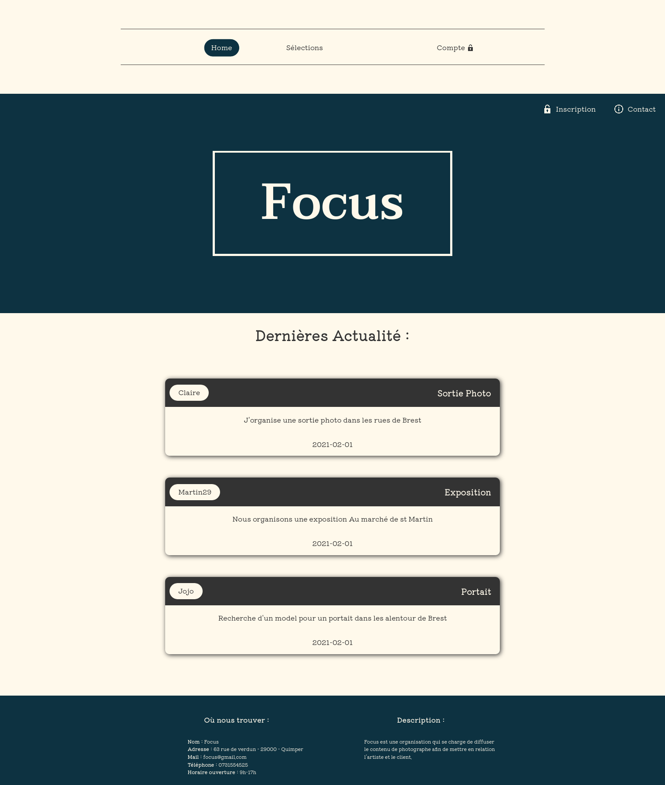
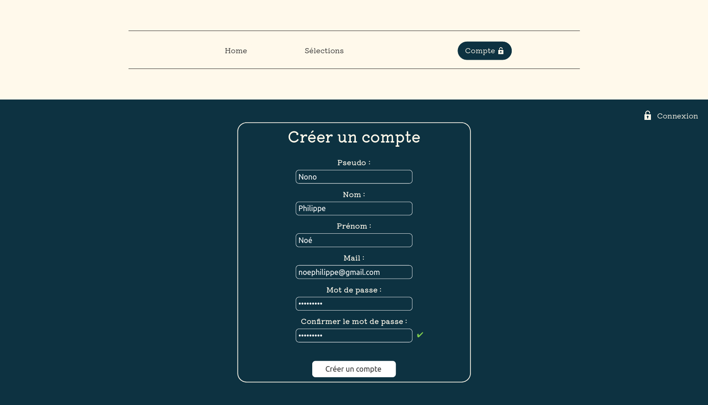
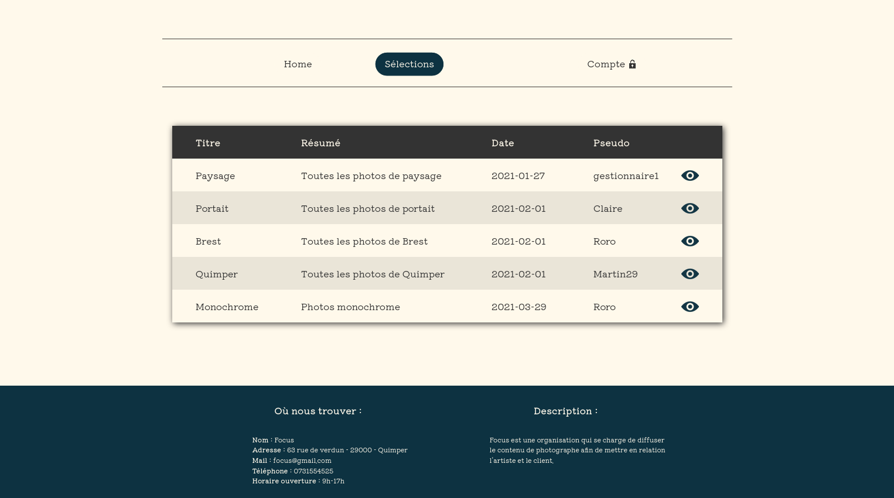
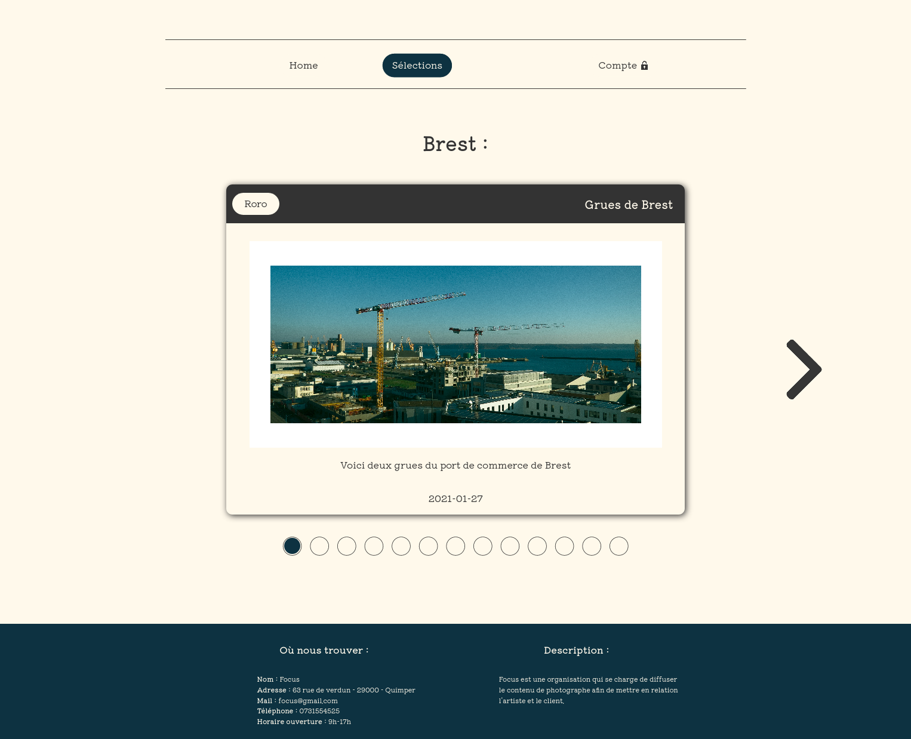

# Développement d'une application web

## Informations

Projet d'école qui a pour objectif de créer une application web disponible en ligne. Pour plus de détail sur l'application, le cahier des charges est disponible dans le répertoire "documents".  
La gestion de la base de données utilisé est MariaDB.  
La partie front-end est réalisé sur mon temps personnel.  
Le sujet choisi est la photographie.

**date de début :** 25/01/2021

## Développeur

Noé PHILIPPE

## Professeur

Valérie MARC

## Images

   

## Contenu

**documents :** Contient les documents du projet

**bdd :** Création de la base de données et des requêtes pour le showroom

**focus :** Test personnel de PHP

**gabarit :** Site sans PHP

**v1 :** Version 1 du site

**images :** Quelques images du showroom

## Langages

PHP/SQL
HTML/CSS/javascript
