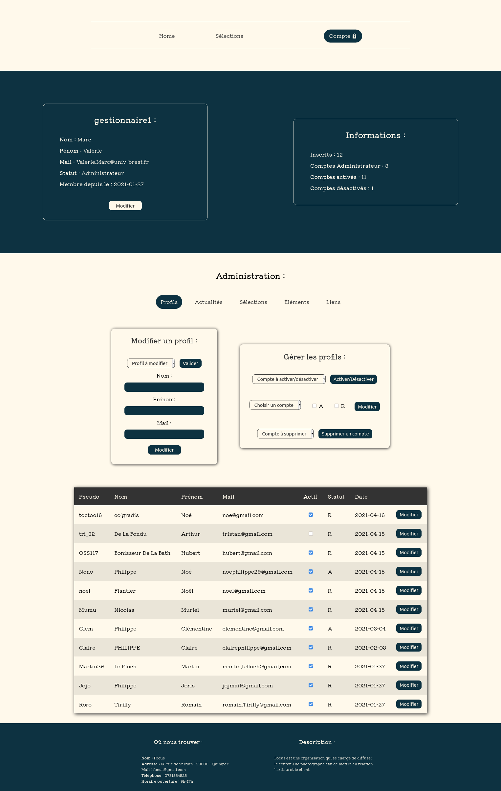

# Développement d'une application web

## Informations

Projet d'école qui a pour objectif de créer un showroom disponible en ligne. Pour plus de détails, le cahier des charges est disponible dans le répertoire "documents".  
La gestion de la base de données utilisé est MariaDB.  
La partie front-end est réalisé sur mon temps personnel sans Frameworks ou Libraries.  
Le sujet choisi est la photographie.

**date de début :** 25/01/2021

## Développeur

Noé PHILIPPE

## Professeur

Valérie MARC

## Images

   

## Contenu

**documents :** Cahier des charges

**bdd :** Création de la base de données et des requêtes pour le showroom

**v1-v2-v3 :** Différentes versions du showroom

**images :** Quelques images du showroom

## Langages

PHP/SQL
HTML/CSS/javascript
